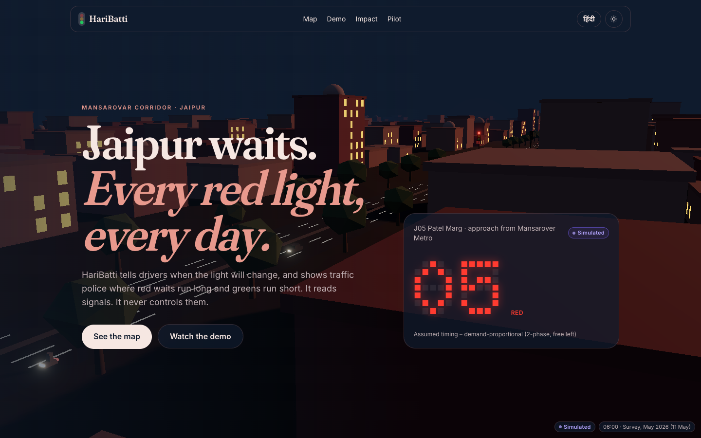
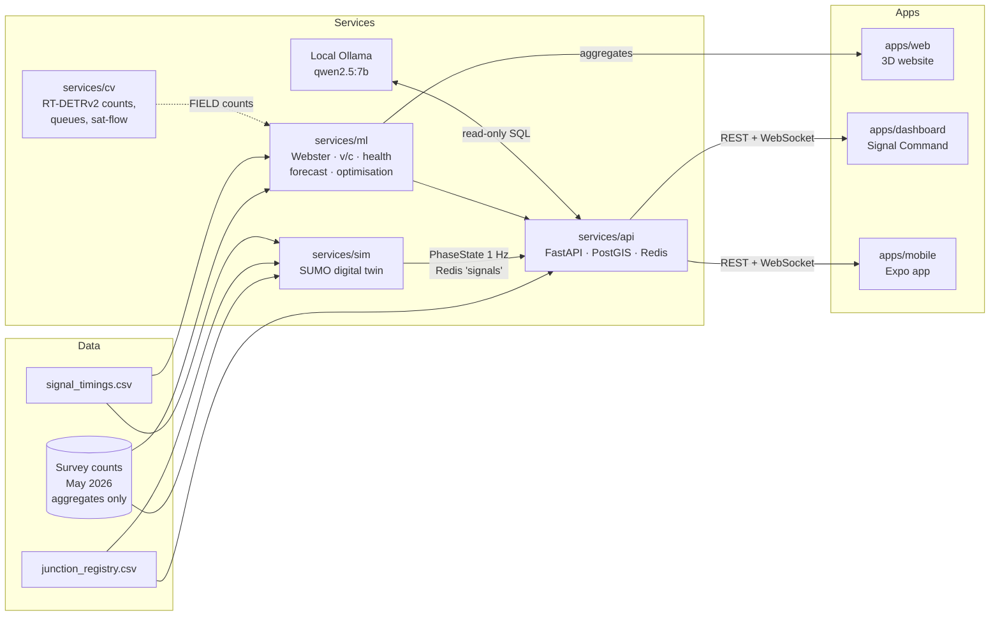

# HariBatti — Jaipur signal countdowns and signal audits

**Live site:** https://hari-batti-jaipur.vercel.app (English · हिंदी · light/dark)

HariBatti ("green light") is a **read-only** traffic-signal intelligence platform for Jaipur's
Mansarovar corridor (junctions J01–J08). It gives drivers a countdown to the next signal change
and gives traffic police an audit of where red waits run long and greens run short — built on
professional 24-hour turning-movement counts from May 2026. **It never controls a signal.**

> Independent project, not affiliated with Rajasthan Police or Jaipur Traffic Police.



**The vehicle set** — 15 original low-poly models of Jaipur traffic, built in code with headless
Blender (`tools/blender/`), one shared palette material, Draco-compressed (472 KB for all models
with LODs):


## Architecture



Every number carries its source label: **SIM** (simulated), **FIELD** (measured by us),
**SURVEY** (May 2026 counts), **CROWD** (app estimates) or **ITMS** (police feed).

| Path | What it is |
| --- | --- |
| `apps/web` | Next.js 15 + React Three Fiber scroll story, MapLibre 3D map, green-wave demo, impact calculator |
| `apps/dashboard` | Signal Command dashboard for the Traffic DCP / Abhay Command Centre |
| `apps/mobile` | Expo app: countdowns and voice speed advice (never says "go") |
| `services/api` | FastAPI: junctions, metrics, live WebSocket, Plan Studio, local AI copilot, citizen reports |
| `services/sim` | SUMO digital twin: network, survey-fitted demand, signal plans, GEH calibration |
| `services/ml` | Webster, v/c, Junction Health Score, forecasting, signal optimisation |
| `packages/core` | Shared types + `adviseSpeed` (GLOSA) with tests |
| `docs/` | [Overview](docs/00-overview.md) · [website](docs/01-website.md) · [dashboard](docs/02-dashboard.md) · [mobile](docs/03-mobile.md) · [runbook](docs/04-runbook.md) · [data findings](docs/05-data-analysis.md) |

## Tech stack

| Layer | Choice |
| --- | --- |
| Website | Next.js 15, React 19, React Three Fiber, drei, postprocessing, MapLibre GL + OpenFreeMap, Motion, Lenis, Tailwind CSS 4 |
| Dashboard | Next.js, Recharts, MapLibre |
| Mobile | Expo SDK 57, React Native 0.86 |
| API | FastAPI, SQLAlchemy 2, PostgreSQL 16 + PostGIS, Redis 7, Alembic |
| Simulation | Eclipse SUMO 1.27 (TraCI, routeSampler, sublane model), left-hand traffic |
| ML | NumPy, scikit-learn, Webster/HCM formulas |
| AI copilot | Local Ollama `qwen2.5:7b` with a read-only SQL guard — no paid API |
| Tooling | pnpm 12 workspaces, uv (Python 3.12), Vitest, pytest, ruff, ESLint, GitHub Actions |

## Honest status

| Part | Status | Notes |
| --- | --- | --- |
| Monorepo, shared types, GLOSA v2 | ✅ Done | `adviseSpeed` prefers the fastest safe speed (300 m example → 45 km/h). Demo: 1.5 → 0.6 stops per ride and 18 s shorter (Simulated) |
| SUMO simulator + live stream | ✅ Done | Schematic network until junction coordinates are verified |
| Simulator calibration | ❌ Not passing | 2-h peak run: GEH<5 for 21% of movement-hours (target 85%), heavy gridlock — being fixed |
| API | ✅ Done | 25 tests; serves file-based data even without the database |
| Analytics | ✅ Done | 15 of 64 approach-peaks above v/c 0.9 (assumed lanes and timing). The forecaster does **not** beat the seasonal-naive baseline yet (only 2 survey days) |
| 3D website | ✅ Deployed | Mock signals, no backend needed. Blender vehicle set + Pink City frontage; vehicle-class section with the survey's own PCU factors (recovered exactly, R² = 1) |
| Signal Command dashboard | ✅ Done | 11 screens in English and Hindi, light/dark, phone to desktop: overview, live wall, junction detail, fairness audit (PDF/CSV), Plan Studio (SUMO before/after + time-space diagram), ML & models, local AI copilot, citizen reports, events + green corridor, monthly report, audit log. Email OTP with Viewer/Operator/Admin roles. Playwright smoke tests: `make e2e-dashboard` |
| Mobile app | 🚧 Planned | |
| Computer vision | 🚧 Planned | RT-DETRv2 (Apache-2.0), privacy blur first |

All signal timings are **assumed** until stopwatch timings are collected; junction positions on
the map are **unverified** OpenStreetMap matches.

## Run it locally (macOS)

Needs Node ≥ 22, pnpm 12, uv, Docker (OrbStack) and optionally Ollama.

```bash
pnpm install
make infra          # Postgres/PostGIS on :5434, Redis on :6380
make sim            # SUMO → Redis channel "signals" at 1 Hz
make api            # http://localhost:8000/docs
pnpm dev:web        # http://localhost:3000
pnpm dev:dashboard  # http://localhost:3001
```

Or everything at once, offline: `make demo` (simulator from the 18:15 PM peak, API, dashboard and
website). Sign in to the dashboard as `admin@haribatti.local`; on a laptop the login screen shows the
one-time code because no email service runs.

| Service | Port |
| --- | --- |
| Postgres + PostGIS (Docker) | 5434 (Homebrew Postgres keeps 5432 and 5433) |
| Redis (Docker) | 6380 (Homebrew Redis keeps 6379) |
| API | 8000 |
| Website / Dashboard | 3000 / 3001 |
| Ollama | 11434 |

Settings live in `.env` (copy `.env.example`). Checks:
`pnpm lint && pnpm test && pnpm build && make test-py`. Every command: [docs/04-runbook.md](docs/04-runbook.md).

The raw survey workbooks and the full 15-minute count table are confidential and are **not** in
this repository; tests that need them skip automatically. Public outputs use aggregates only.

## Data and attribution

- Traffic counts: classified 24-hour turning-movement survey, 8 Mansarovar junctions,
  11–12 May 2026 (aggregates only in this repo).
- Map data © OpenStreetMap contributors (ODbL); tiles by OpenFreeMap.
- Third-party models, datasets and fonts: [THIRD_PARTY.md](THIRD_PARTY.md).

## Licence

No licence has been chosen yet, so all rights are reserved by the author for now.
