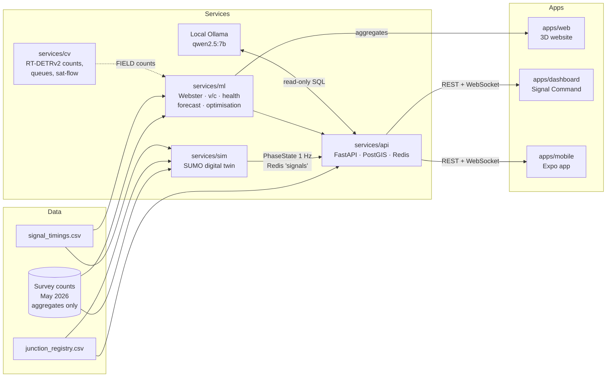

# HariBatti — Jaipur signal countdowns and signal audits

**Live site:** https://hari-batti-jaipur.vercel.app (English · हिंदी · light/dark)

HariBatti ("green light") is a **read-only** traffic-signal intelligence platform for Jaipur's
Mansarovar corridor (junctions J01–J08). It gives drivers a countdown to the next signal change
and gives traffic police an audit of where red waits run long and greens run short — built on
professional 24-hour turning-movement counts from May 2026. **It never controls a signal.**

> Independent project, not affiliated with Rajasthan Police or Jaipur Traffic Police.


**The vehicle set** — 15 original low-poly models of Jaipur traffic, built in code with headless
Blender (`tools/blender/`), one shared palette material, Draco-compressed (472 KB for all models
with LODs):


## Architecture



Every number carries its source label: **SIM** (simulated), **FIELD** (measured by us),
**SURVEY** (May 2026 counts), **CROWD** (app estimates) or **ITMS** (police feed).

| Path | What it is |
| --- | --- |
| `apps/web` | Next.js 15 + React Three Fiber scroll story, MapLibre 3D map, green-wave demo, impact calculator |
| `apps/dashboard` | Signal Command dashboard for the Traffic DCP / Abhay Command Centre |
| `apps/mobile` | Expo app: countdowns and voice speed advice (never says "go") |
| `services/api` | FastAPI: junctions, metrics, live WebSocket, Plan Studio, local AI copilot, citizen reports |
| `services/sim` | SUMO digital twin: network, survey-fitted demand, signal plans, GEH calibration |
| `services/ml` | Webster, v/c, Junction Health Score, forecasting, signal optimisation |
| `packages/core` | Shared types + `adviseSpeed` (GLOSA) with tests |
| `docs/` | [Overview](docs/00-overview.md) · [website](docs/01-website.md) · [dashboard](docs/02-dashboard.md) · [mobile](docs/03-mobile.md) · [runbook](docs/04-runbook.md) · [data findings](docs/05-data-analysis.md) · [data connectors](docs/data-connectors.md) · [pilot operations](docs/pilot-operations.md) |

## Tech stack

| Layer | Choice |
| --- | --- |
| Website | Next.js 15, React 19, React Three Fiber, drei, postprocessing, MapLibre GL + OpenFreeMap, Motion, Lenis, Tailwind CSS 4 |
| Dashboard | Next.js, Recharts, MapLibre |
| Mobile | Expo SDK 57, React Native 0.86 |
| API | FastAPI, SQLAlchemy 2, PostgreSQL 16 + PostGIS, Redis 7, Alembic |
| Simulation | Eclipse SUMO 1.27 (TraCI, routeSampler, sublane model), left-hand traffic |
| ML | NumPy, scikit-learn, LightGBM, PyTorch; Optuna (calibration); sumo-rl + Stable-Baselines3 PPO (signal control, SIM); RT-DETRv2 + ByteTrack (vision) |
| AI copilot | Local Ollama `qwen2.5:7b` with a read-only SQL guard — no paid API |
| Tooling | pnpm 12 workspaces, uv (Python 3.12), Vitest, pytest, ruff, ESLint, GitHub Actions |

## Honest status

| Part | Status | Notes |
| --- | --- | --- |
| Monorepo, shared types, GLOSA v2 | ✅ Done | `adviseSpeed` prefers the fastest safe speed (300 m example → 45 km/h). Demo: 1.5 → 0.6 stops per ride and 18 s shorter (Simulated) |
| SUMO simulator + live stream | ✅ Done | Schematic network until junction coordinates are verified |
| Simulator calibration (W1) | ❌ Not passing (reported honestly) | Full day: GEH<5 for 49% of movement-hours on 11 May, 46% on 12 May (target 85%); 30% of demand cannot enter. Up from 21% after removing invented side roads and an Optuna search (30 trials, lanes ±1). The schematic geometry and assumed lanes are the limit; verified coordinates, lane counts and stopwatch timings come next. [Report](services/sim/reports/calibration.md) |
| Signal-timing optimisation (W2) | ✅ Done (SIM) | Held-out day, 5 seeds: MaxPressure cuts corridor travel time 35% vs the assumed even split (715 vs 1,093 s); a PPO single-junction agent is best at 4 of 6 junctions alone; the corridor PPO agent is under-trained and worst; green-wave offsets (51 s bands both ways) cannot help while the corridor is oversaturated. Recommendations only. [Report](services/ml/reports/optimisation.md) |
| API | ✅ Done | 119 tests; read-only (a test lists every allowed write); serves file-based data even without the database |
| Data connectors (P8 W12) | ✅ Done (ready for a real feed) | Read-only adapters for a police ITMS or vendor feed: HTTP polling (GET only), WebSocket, MQTT (subscribe only), CSV/Excel drop folder, SAE J2735 SPaT JSON, record/replay; timing-plan import from CSV/Excel/PDF into a *proposed* file for human review. Per-tenant ID mapping edited on the dashboard with a live preview; `SIGNAL_SOURCE=<id>` switches the live feed. A test fails if any connector gains a write method. No real feed connected yet. [Guide](docs/data-connectors.md) |
| Pilot operations + tenants (P8 W13) | ✅ Done (ready for a pilot) | Pilot mode: dates, success measures (baseline vs now vs goal; unmeasured values shown as placeholders, never estimated; two Jaipur baselines computed from the survey), officer notes and pins, 👍/👎 on every insight, weekly 5-question review, log of timing changes officers made, printable Pilot Evidence Pack (English/Hindi). Onboarding wizard for a new organisation (police, campus, township, fleet) with sites, sources, users and report template; a *Campus Demo – SIM* tenant for prospects. [Guide](docs/pilot-operations.md) |
| Security readiness (P8 W16) | ✅ Done (audit-ready, not yet audited) | OWASP ASVS L1 checklist 90% done: login-code rate limits, server-side sign-out, role check on every write route (tested against all routes), CSP/HSTS/nosniff headers on API, website and dashboard, copilot runs as a read-only database role that can see only its views, SQL function allow-list, production refuses development settings. CI: pnpm audit, pip-audit, gitleaks, CycloneDX SBOM, Dependabot; 0 known vulnerabilities (MapLibre upgraded to 6.11). DPDP: data export and erasure requests, daily retention job. Draft privacy policy, terms, DPA and disclosure policy (lawyer review pending). [SECURITY.md](SECURITY.md) |
| Monitoring (P8 W11) | ✅ Done | `/health`, `/ready`, Prometheus `/metrics`; freshness monitor per source (feed stale after 30 s, junction dark, impossible values: negative or > 300 s remaining, green < 3 s) — killing the simulator raised the alert in 35 s; alerts to the log, and to email / Telegram when configured; per-minute uptime ledger with daily % (goal 99% over 30 days) on the dashboard Status page; public status page on the website |
| Commercial surfaces (P8 W17) | ✅ Done | Website pricing (free 60-day pilot + 4 offers, prices on request), security & privacy page, pilot-request form (honeypot, fill-time and rate-limit spam checks, no trackers) stored by the API; usage metering per organisation (sites, members, active users, API calls) with CSV export for invoices on the dashboard Business page; no payment processing |
| Field study kit (P8 W14) | ✅ Ready (no drives yet) | App Study mode behind an invite code: explicit consent, random participant ID, advice ON/OFF assigned by the server in blocks of two, GPS at 1 Hz only during a run, automatic stop 250 m after the last signal, upload; the server trims 200 m at each end and deletes traces after 30 days; leaving the study deletes your traces. Analysis (`make field-study`): stops, travel time, time stopped, speed profile, bootstrap 95% CIs, permutation test and a power note. On 20 synthetic runs (SIM, pipeline test only): stops 1.6 → 0.4 per run; travel time CI crosses zero, so no claim. [Report](services/ml/reports/field_study.md) |
| Junction video intake (P8 W15) | ✅ Done (ready for your clip) | Dashboard Video intake (Operators): streamed upload up to 2 GB with type, signature and decode checks; guided camera setup on a privacy-blurred first frame (approach areas, count lines, stop line, lamp box, crosswalk); background analysis with the W4 pipeline; FIELD results (turning counts, approach volumes, queues, saturation flow, lamp timings, pedestrian crossings) withheld when video quality is poor; blurred preview and CSV downloads; measured timings go to a *proposed* file for review. Tested end to end on the CC-licensed Cuttack clip as a DEMO (never counted as Jaipur data): 60 s analysed in 96 s, 16 movements, 45 pedestrian crossings, saturation flow honestly "not measured" (too few queued vehicles). Raw videos deleted after 30 days |
| Load test and scaling (P8 W10) | ✅ Done (SIM) | 10,000 WebSocket clients + 400 synthetic junctions + 200 req/s on one laptop: p95 message lag 657 ms (goal < 1.5 s), 0 connection errors, HTTP p95 47 ms with 4 workers. Before the fixes one worker failed at 1,000 clients (p95 lag 4.7 s). Fixes: one broadcaster that batches and serialises once per subscription, per-junction subscriptions, multiple workers without per-message compression. [Report](services/api/reports/loadtest.md) · [Scaling](docs/scaling.md) |
| Analytics | ✅ Done | 15 of 64 approach-peaks above v/c 0.9 (assumed lanes and timing) |
| Forecasting + anomalies (W5) | ✅ Done | Real data: only 2 days, and 12 May turns out to be almost a copy of 11 May (correlation 0.9999, 27% identical — flagged in data/README.md), so no real-data skill is claimed. On 8 simulated weeks: LightGBM WAPE 11.2% vs 16.2% weekly naive; 90% conformal band covers 89.9%; anomaly recall 83%, alarm precision 28% (SIM). [Report](services/ml/reports/forecasting.md) |
| 3D website | ✅ Deployed | Mock signals, no backend needed. Blender vehicle set + Pink City frontage; vehicle-class section with the survey's own PCU factors (recovered exactly, R² = 1); Evidence section with interactive charts of every model result |
| Signal Command dashboard | ✅ Done | 19 screens in English and Hindi, light/dark, phone to desktop: overview, live wall, junction detail, fairness audit (PDF/CSV), Plan Studio (SUMO before/after + time-space diagram), ML & models, local AI copilot, citizen reports, video intake, events + green corridor, monthly report, pilot + evidence pack, my account (data export/erasure), system status, business (usage + pilot requests), onboarding, data connectors, audit log. Email OTP with Viewer/Operator/Admin roles. Playwright smoke tests: `make e2e-dashboard` |
| Mobile app (W8) | ✅ Built, not yet on phones | Expo app in English and Hindi: live countdowns, GLOSA v2 voice advice (never "go", ≤ limit − 5 km/h, taps locked above 5 km/h), walk mode, citizen reports, simulated ride. 15 safety/logic tests; verified in the browser build. Android APK via EAS waits for the owner's go-ahead |
| Computer vision (W4) | ✅ Done | RT-DETRv2-S with IISc UVH-26 weights (Apache-2.0): mAP50:95 0.611 on 14 Indian classes; 0.745 vs 0.339 for the COCO model on shared classes (400 validation images). Faces and plates blurred before any frame is saved. `make cv-video VIDEO=… JUNCTION=J05`. [Report](services/cv/reports/cv_eval.md) |

All signal timings are **assumed** until stopwatch timings are collected; junction positions on
the map are **unverified** OpenStreetMap matches.

## Run it locally (macOS)

Needs Node ≥ 22, pnpm 12, uv, Docker (OrbStack) and optionally Ollama.

```bash
pnpm install
make infra          # Postgres/PostGIS on :5434, Redis on :6380
make sim            # SUMO → Redis channel "signals" at 1 Hz
make api            # http://localhost:8000/docs
pnpm dev:web        # http://localhost:3000
pnpm dev:dashboard  # http://localhost:3001
```

Or everything at once, offline: `make demo` (simulator from the 18:15 PM peak, API, dashboard and
website). Sign in to the dashboard as `admin@haribatti.local`; on a laptop the login screen shows the
one-time code because no email service runs.

| Service | Port |
| --- | --- |
| Postgres + PostGIS (Docker) | 5434 (Homebrew Postgres keeps 5432 and 5433) |
| Redis (Docker) | 6380 (Homebrew Redis keeps 6379) |
| API | 8000 |
| Website / Dashboard | 3000 / 3001 |
| Ollama | 11434 |

Settings live in `.env` (copy `.env.example`). Checks:
`pnpm lint && pnpm test && pnpm build && make test-py`. Every command: [docs/04-runbook.md](docs/04-runbook.md).

The raw survey workbooks and the full 15-minute count table are confidential and are **not** in
this repository; tests that need them skip automatically. Public outputs use aggregates only.

## Data and attribution

- Traffic counts: classified 24-hour turning-movement survey, 8 Mansarovar junctions,
  11–12 May 2026 (aggregates only in this repo).
- Map data © OpenStreetMap contributors (ODbL); tiles by OpenFreeMap.
- Third-party models, datasets and fonts: [THIRD_PARTY.md](THIRD_PARTY.md).

## Licence

No licence has been chosen yet, so all rights are reserved by the author for now.
